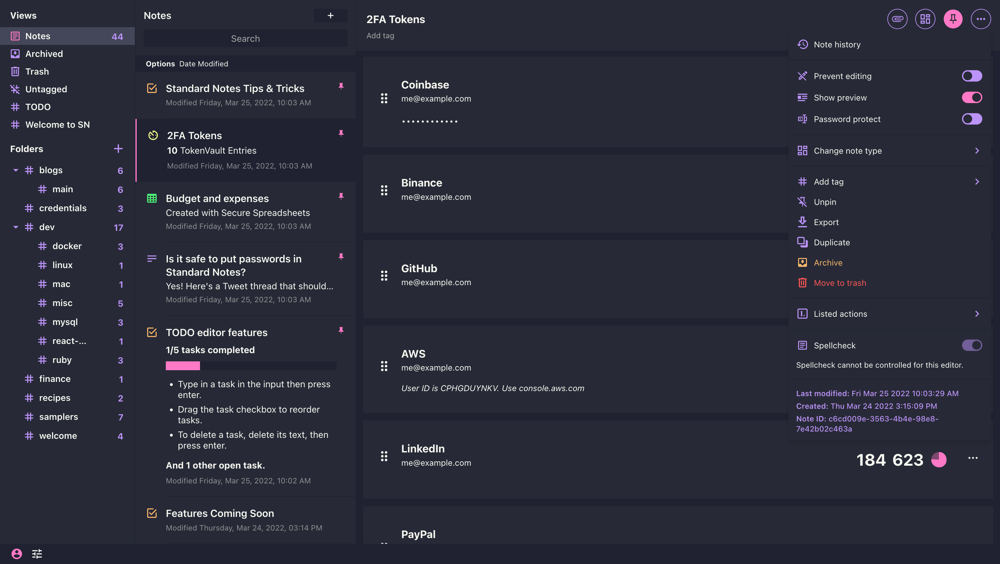

# Dracula Theme for [Standard Notes](https://standardnotes.org/)

> A dark theme for [Standard Notes](https://standardnotes.org/)

The editor used in the screenshot is the [Rich Markdown Editor](https://github.com/arturolinares/sn-rme).

## Install

All instructions can be found at [draculatheme.com/standard-notes](https://draculatheme.com/standard-notes).

## Team

This theme is maintained by the following person(s) and a bunch of [awesome contributors](https://github.com/dracula/standard-notes/graphs/contributors).

 |
--- |
[Sly Bouhafs](https://github.com/slybouhafs)

## License

[MIT License](./LICENSE)
